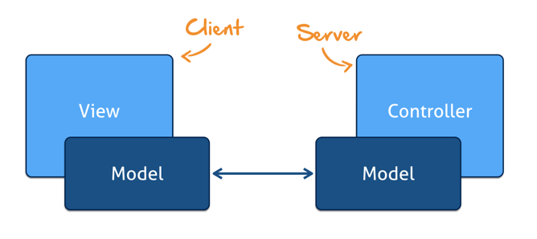
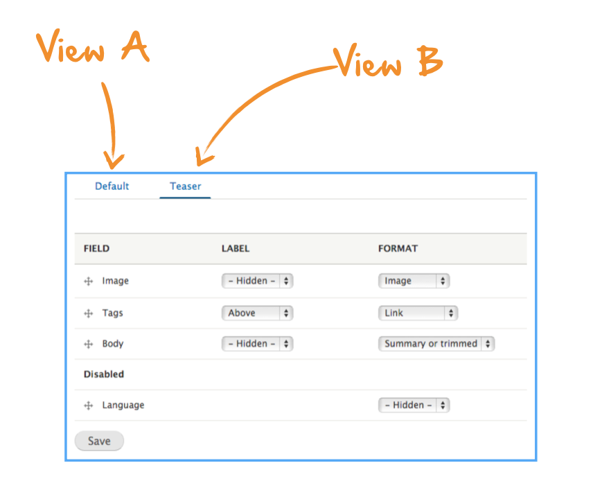
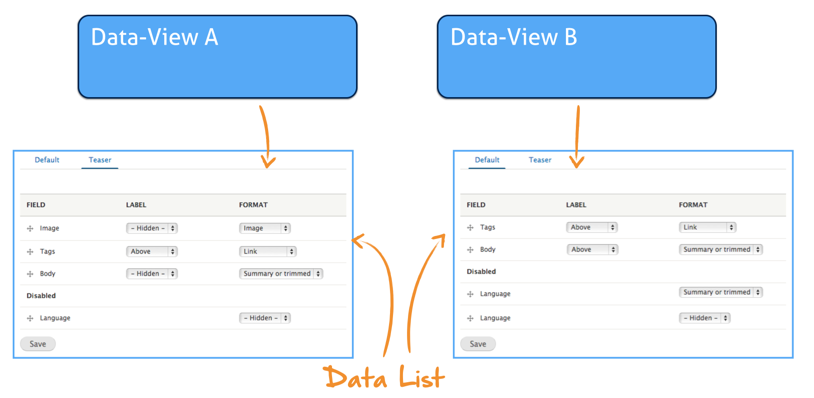
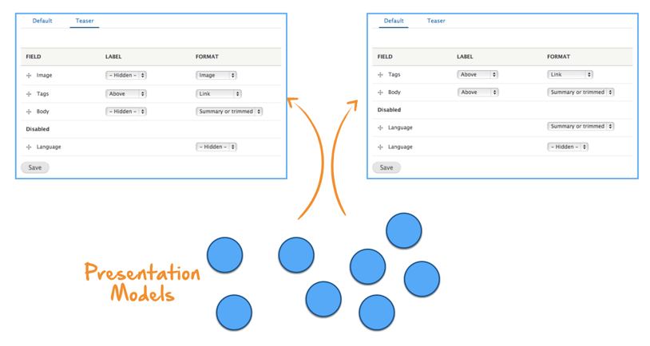
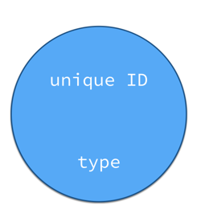
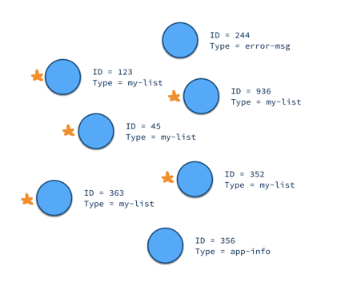
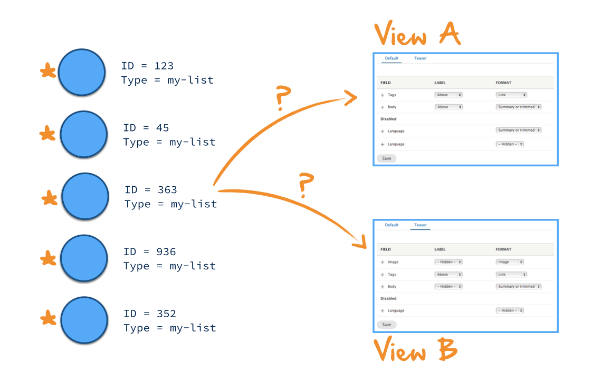
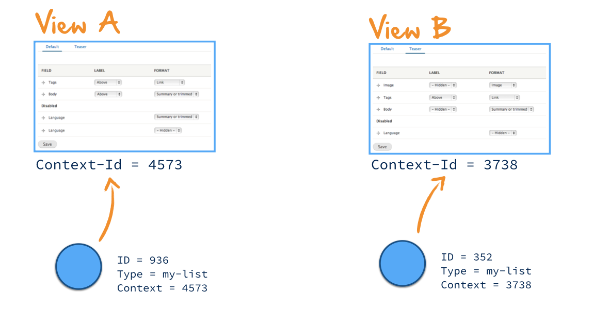
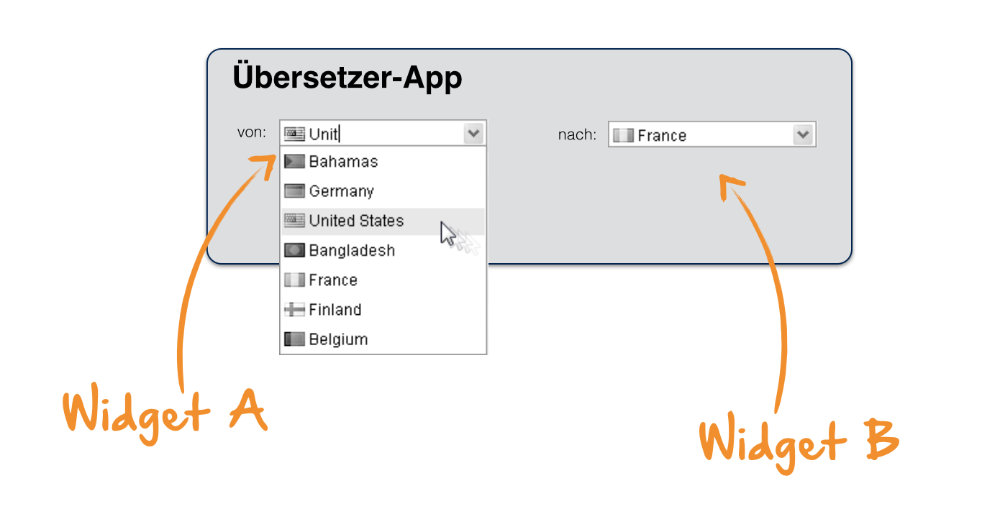
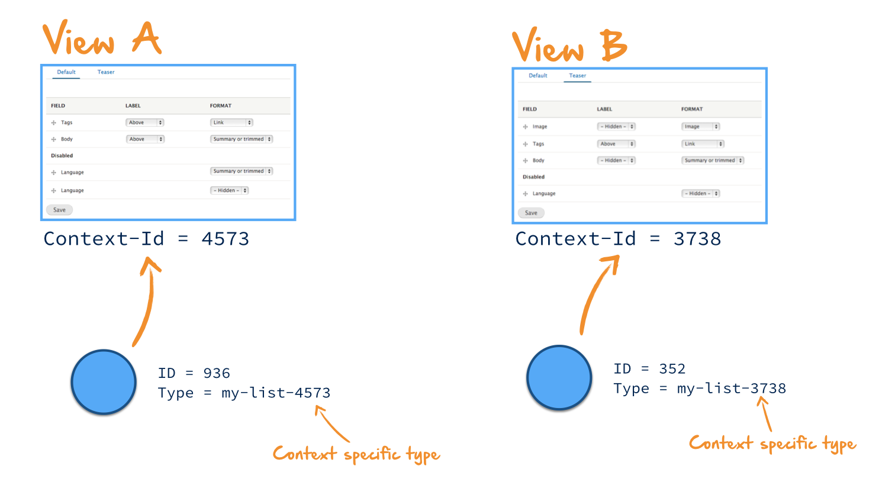

hier kommt rein, was die platform bereitstellen soll:
-
-
-

Managed Commands auf Serverseite
---------------
Im Server sollten Commands managed sein. Hier ist noch nicht 100% geklärt, worauf wir da am besten aufsetzten. Im Idealfall gibt es wahrscheinlich 3 Implementierungen:#
- JavaEE CDI
- Spring
- Google Guava

Für JavaEE gibt es verschiedene Links die beschreiben wie man durch Nutzung der CDI Spec Managed Beans erstellen kann:
https://rmannibucau.wordpress.com/2013/08/19/adding-legacy-beans-to-cdi-context-a-cdi-extension-sample/
https://docs.jboss.org/weld/reference/latest/en-US/html/extend.html
Für Spring haben wir das ganze bereits im Ansatz für die KaPo Demo realisiert

PresentationModel <-> Object Mapping
---------------
Für die Dolphin Platform wär es cool, wenn man direkt mit Objekten arbeiten könnte. Hierbei würden die PresentationModels in Objekte gemappt. Michael experiementiert aktuell in diesem Bereich. Will man dies hinbekommen, muss man sicherlich interne Attribute definieren die vond er Dolphin-Platform automatisch in PMs gesetzt und verwaltet werden.
In JavaFX hätte man dann sicher eine Art Binding-Klassen. Vielleicht kann man das ganze ähnlich (wie von Michael vorgeschlagen) wie JPA aufbauen. Man kann dann ein Java Pojo definieren und durch Annotations das Binding nach Dolphin festlegen. 
In javaScript wär es sicher cool, wenn man einfach JavaScript Objekte hätte auf die man wie gewohnt drauf zugreifen kann:
	myObject.name

UI-Binding auf ClientSeite
---------------
Schaut man sich aktuelle JavaScript Frameworks wie Angular oder Polymer an erkennt man, dass hier Bindings immer direkt im HTML gesetzt werden:

	<button title={myBinding}>

In JavaFX geht man aktuell einen anderen Weg und definiert die Bindings im Controller indem man die Gui-Komponenten in den Controller injected.
Er wär sicherlich Sinnvoll, wenn man für die Dolphin Platform hier einen einheitlichen Weg hätte, wobei aktuell beide Varianten vor und Nachteile haben:
In der JavaScript Variante hat man (theoretisch) UI-Toolkit unabhängige Controller da das Property- & Action-Binding in der View passiert
In JavaFX hat man zwar UI-Toolkit spezifische Controller, dafür besitzt die UI-Definitionen nun Kenntniss der Logik. 
Da wir mit Nutzung der Dolphin-Platform aber so wenig Controller wie möglich auf der CLient-Seite haben wollen, finde ich aktuell die erste Variante sehr cool. Dazu kommt, dass die ersten Projekte alle auf JS basieren und wir somit weniger Aufwand zum Start hätten. Für JavaFX würd edas bedeuten, dass man im Idealfall FXML so aufbort, dass man hier direkt Bindings zu Dolphin angeben und z.B. bei ButtonClicks Dolphin-Commands definieren kann.
Allerdings sollte man bei der Überlegung iOS und Android nicht außen vor lassen. Ich denke, dass diese beiden Platformen wichtig sind, wenn wir mit der DOlphin Platform erfolg haben wollen. Möglicherweise muss man hier dann mit Zwischen-Klassen (Binder-Klassen) arbeiten

Lifecycle von Views
---------------
Die meiste Zeit wird man mit der Dolphin-Platform sicherlich Dialoge erstellen. Hier ist es meiner Meinung nach sinnvoll einen default Lifecycle zu definieren.
Ich könnte mir zum Beispiel folgendes vorstellen:
Jeder Dialog-Typ ist durch ein PM-Typ definiert. Sobald auf Serverseite ein neues PM vom typ erstellt wird geht der Client her und erzeugt den passenden Dialog.
Auf Client-Seite gibt es eine Art Routing in dem definiert ist, welche PM-Typen zu welchem Dialog gehören und wie dieser dann angezeigt wird. Das ist im Web relativ einfach, da man hier in der Regal immer einfach einen Dialog anzeigt. Sobald man aber z.B. einen Desktop-Client hat in dem Tabs erlaubt sind sieht das ganze schon anders aus. Aber auch im Web will man sicherlich Fehlerdialoge, globale Notifications, etc. anzeigen.

Context vom PresentationModel
---------------
Schnell kommt man an den Punkt, dass man entweder Listen von Daten anzeigen will oder den gleichen Datentyp 2x auf dem Bildschirm hat. In diesem Fall muss dem PM ein Kontext zugeordnet werden. Dieser Context muss sowohl auf Client- als auch auf Serverseite bekannt sein.

Idee zum Aufbau von Commands auf Severseite
---------------
Bisher sind wir (Baloise & KaPo) hergegangen und haben pro Command eine Klasse definiert. Das ist nicht ganz so sinnvoll, da man innerhalb eines Dialogs oft mit den gleichen Services etc. arbeitet. Hier könnte man dann eine Basis-Klasse für den spezifische Dialog machen und davon alle konkreten Command-Klassen des Dialogs ableiten. Besser fände ich aber die Möglichkeit, dass ich pro Dialog einfach eine Klasse habe. In dieser Klasse kann ich nun mehrere Methoden definieren die für Commands stehen. Diese können dann durch Annotations definiert und einem speziellen Command zugeordnet werden. Beispiel:
	@DolphinManaged
	public class MyDialogHandler {
		
		@DolphinCommand(„MyDialogInit“)
		public void init() {…}

		@DolphinCommand(„MyDialogSave“)
		public void save() {…}

		@DolphinCommand(„MyDialogClose“)
		public void close() {…}
	}
Hier hab ich noch ein paar weitere Ideen zum Aufbau, will aber erstmal abwarten, was sonst so an Ideen reinkommt :)

Aufbau der Module (Ideen)
---------------

Hier muss man erst einmal zwischen den Programmiersprachen unterschieden. Das meiste macht allerdings der Java-Teil aus.

Java:
- Core-Modul: Das ganze wird sowohl im Client als auch im Server genutzt und beinhaltet allgemeine Klassen
- Server-Modul: Grundlegende Klasse, Interfaces und Annotations für die Server-Seite. Hier ist definiert, wie man mit Commands und PMs im Server arbeitet. Das ganze ist allerdings noch JavaEE / Spring unspezifisch. Die Intergration in einem spezifischen Web-Container liegt in extra Modulen
- Server-JavaEE-Modul: CDI-Extension um Dolphin Commands in einem JavaEE 7 Server managed nutzen zu können
- Server-Spring-Modul: Spring-Extension um Dolphin Commands in einem Server Server managed nutzen zu können
- Client-Modul: Allgemeine Klassen für die Integration der Dolphin Platform auf Client-Seite. Das ganze sollte (mit zukünftiger Betrachtung von iOS & Android) keine JavaFX spezifischen Klassen beinhalten. Dazu kommt, dass man hier wegen Android keine Java8 Features nutzen darf (RetroLambda?).
- JavaFX-Client-Modul: Integration der Dolphin-Platform für einen JavaFX Client. Hier ist z.B. definiert, wie die Bindings in javaFX realisiert werden etc.

Zukunft:
- iOS-Client-Modul / Android-Client-Modul: Im iOS Umfeld sollte mit RoboVM gearbeitet werden, da somit komplett in Java Entwicklet werden kann. In RoboVM sind für alle Nativen iOS Kompoenten Wrapper-Klassen vorhanden, so dass man mit RoboVM komplett native Anwendungen in Java bauen kann.

JavaScript:
- JavaScript-Client-Modul: Beinhaltet eine JS basierte Iplementierung des Clients. Hier muss dann auch der Inhalt des Java-Client-Moduls nachimplementiert werden

- AngularJS-Modul: Brauche wir das? Ich finde den ICOS Ansatz (Dolphin & WebComponents) für die Zukunft sehr interessant. Bei der KaPo werden wir zwar auf Angualr setzten, im großen und ganze könnte der ICOS Weg aber die richtige Richtung sein.

Update 1 - Grundlegender Aufbau des Servers
---------------
Die Dolphin Platform Server Komponente basiert auf der Servlet API 3.1 und instanziiert sich innerhalb eines Web-Containers automatisch. Die DolphinPlatformBootstrap Klasse implementiert das in der Servlet API definierte Interface ServletContainerInitializer. Implementierungen dieses Interfaces werden beim Application-Start automatisch geladen (Durch ServiceLoader Definition in META-INF/services). Hierdurch startet der Dolphin Plattform Boostrap automatisch. Durch den Start werden die beiden benötigten Servlets (Dolphin-Servlet und Dolphin-Invalidation-Servlet) angelegt und registriert. Das DolphinServlet bekommt automatisch eine Liste der Klassen übergeben die von Dolphin gemanaged werden sollen (Definiert durch die DolphinManaged Annotation). Dies werden die DolphinCommands sein. Sobald eine neue Session erstellt wird, ruft das DolphinServlet den DolphinCommandManager auf. Dieser ist Framework-Abhängig (z.B. Spring oder JavaEE) und kümmert sich darum, dass alle Dolphin Commands automatisch erstellt werden und im richtigen Scope liegen. Der DolphinCommandManager ist im Server-Modul nur als Interface definiert und es muss immer genau eine passende Implementierung geben. Diese wird später in den Framework-Spezifischen Modulen (Spring, etc.) hinzugefügt. Intern wird der ServiceLoader zum Laden und Instanziieren genutzt. Daher müssen alle Implementierungen des DolphinCommandManager Interfaces einen Default-Konstruktor haben.
Durch dieses Vorgehen kann man die Dolphin-Platform Jars einfach zu einer Anwendung hinzufügen und muss nichts mehr konfigurieren. In der eigentlich Anwendung müssen dann nur noch die Command-Klassen definiert und anmontiert werden. Auch eine web.xml wird hier nicht mehr benötigt. Später kann man sich überlegen, ob man ähnlich der persistence.xml eine Datei zur Konfiguration der Dolphin-Platform unterstützen möchte. Hierdurch könnte man in einer Anwendung dann z.B. das Default-Mapping der Servlets überschreiben.

Update 2 - CDI Implementierung für JavaEE
---------------
Habe eine Basis-CDI-Implementierung für JavaEE hinzugefügt. Diese ist allerdings momentan noch ungetestet. Die Implementierung nutzt Apache DeltaSpike um programmatisch Referenzen zu CDI Beans zu erstellen. Hierbei werden Beans für alle Klassen die mit der @DolphinManaged Annotation versehen sind erstellt. Alle diese Beans liegen automatisch im SessionScope.
Theoretisch sollte eine Klasse auf Serverseite nun wie folgt aussehen:

	@DolphinManaged
	public class MyViewController {

		@Inject
		private ServerDolphin dolphin;

		@Inject
		private MyService myInjectedService;

		@DolphinCommand(„unique-command-id-for-save“)
		public void save() {…}

		@DolphinCommand(„unique-command-id-for-load“)
		public void load() {…}
	}

Infos zu Scopes
---------------
Da der Server-Teil CDI nutzt muss sich hier auch Gedanken über Scopes gemacht werden. Beim ServerDolphin sollte das kein Problem sein. Der liegt per Definition schon im SessionScope da es auch ohne CDI genau einen ServerDolphin pro Session gibt. Bei den Commands sieht das aber schon anders aus. Der Scope der Command-Klassen ist theoretisch nicht definiert. Allerdings würde ich nicht hergehen und den vom Entwickler frei definieren lassen. Ich denke hier sollten wir einen Scope vorgeben. Am Einfachsten wäre wenn man entweder den SessionScope passend zum Dolphin verwenden würde. In dem Fall würde es pro Benutzer-Sessionen eine Instanz einer Command-Klasse geben. Eine andere Möglichkeit wär auch der Singleton-Scope. Hiermit würde es dann genau eine Instanz über alle Sessions geben. Die COmmand-Klassen sollten ja in der Regel stateless sein, da der Dolphin und alle Services injected werden. Daher sollte ein Singleton Scope möglich sein. Was meint ihr?

Ein paar Ideen zum Dolphin-OR-Mapping
---------------
Im Idealfall arbeitet man in der Dolphin-Platform nicht mehr mit PresentationModel und Attribut sondern direkt mit Java Objekten. Hierfür muss es dann allerdings einen OR-Mapper (oder eher OPM-Mapper) für Dolphin geben. Das ganze sollte im Idealfall an JPA angelehnt sein, da Entwickler sich hiermit bereits auskennen. Die Objekt-Repräsentation eines PresentationModel-Typs könnte dann zum Beispiel wie folgt aussehen:

	@Model(„My-PM-Type“)
	public class MyDataModel {
		
		@Attribute(„my-property-name“)
		private String name;

		@Attribute(value=„my-property-description“, tag=„my-tag“)
		private String description;

		@Child
		private MyCustomMetadataModel metadata;

		@Children
		private List<MyCustomEntryModel> entries;

		//getter & setter
	}

Wie bereits vorher erwähnt würde ich zu jedem Presentation-Model ein Context-ID definieren. Dieses Attribut ist also immer da. Daher gibt es in der Java-Klasse auch kein ID-Feld. Eine PM besitzt immer einen definierten Typ und eine Context-ID. Die PM-ID wird hierbei immer automatisch vom der Platform auf Serverseite erstellt. Will man die Id trotzdem haben kann man Problemlos folgendes Field in die Objekt-Klasse hinzufügen:

	@ModelId
	private long id;

Da Objekte durch den Model-Typ und die Context-ID definiert werden kann es somit 0,1 oder n passende Instanzen geben. Das ist meiner Meinung nach aber ok, da man bei der Entwicklung ja weiß, ob man nun eine Liste oder ein Objekt erwartet. Zum finden der Objekte wird es dann so etwas wie einen EntityManager geben der die benötigten Funktionen liefert:

	MyDataModel model = manager.find(MyDataModel.class, contextId);

Durch das Übergeben der Klasse kann der Manager den PM-Typ ermitteln (Reflection) und kann nun alle MPs von dem Typ finden. Über eine weitere Filterung werden nun die MPs rausgefiltert welche nicht die Context-ID haben. Diese ist immer als Attribut im PM vorhanden. Sollte es am Ende mehr als ein Objekt geben schmeißt der Manager eine Runtime-Exception. Will man eine Liste haben kann man analog folgendes tun:
	List<MyDataModel> models = manager.findAll(MyDataModel.class, contextId);
Wie man genau an die Context-ID kommt wird später geklärt und soll hier erst einmal nicht interessieren. Wichtig ist nur, dass sie die aktuelle Gui-Komponente in der das Objekt „lebt“ widerspiegelt. Ist man aber innerhalb des Models an der ContextID oder dem Typ interessiert kann man folgende Felder hinzufügen:

	@ModelType
	private String type;

	@ContextId
	private long contextId;

Wenn man nun die Child-Beziehung im Beispiel einmal außen vor lässt (dazu komm ich gleich) würde das passende PM wie folgt aussehen:

	PM(id=unique-long, type=„My-PM-Type“)
		Attribute(property-name=„my-property-name“)
		Attribute(property-name=„my-property-description“, tag=„my-tag“)
		Attribute(property-name=„context-id“)

Bei den Kindbeziehungen würde ich hergehen und immer mit zusätzlichen MPs arbeiten die eine Verknüpfung definieren. Alle diese MPs haben den gleichen Typ (z.B. „object-relation“) und definieren eine Vater-Kind-Beziehung. Ein solches PM könnte nun also wie folgt aussehen:

	PM(id=unique-long, type=„object-relation“)
		Attribute(property-name=„parent-id“)
		Attribute(property-name=„child-id“)

Wird nun ein Objekt geladen können einfach alle MPs gesucht werden bei dem das PM des zu ladenden Objektes als Parent eingetragen ist (durch Referenz der PM-id im „parent-id“ Attribut). Wir die @Child Annotation verwendet darf es nur 0 oder 1 passenden Eintrag geben. Ansonsten wird eine Runtime-Exception geworfen. Wird @Children verwendet darf es 0-n Einträge geben. Durch dieses Verfahren werden nun rekursiv die Objekte erstellt.
Will man Objekte erstellen oder löschen kann hier auch einfach der manager genutzt werden:

	//Erstellen eines neuen Models
	MyDataModel model = new 	MyDataModel();
	model.setName(…);
	manager.manage(model);

 	//Löschen eines Models
	manager.remove(model);

So kann man sicherlich relativ viel abbilden, allerdings bietet Dolphin einige zusätzliche Funktionen die hier noch nicht abgedeckt sind. Ein Problem ist sicherlich die Automatische Synchronisation. Gehen wir mal von folgender Code-Zeile aus:
	
	model.setName(„new Name“);

Hierdurch wird einfach das String field neu gesetzt, was keine Auswirkungen auf das PM hat. Um dies zu Lösen gibt es verschiedene Möglichkeiten:

Die erste Variante ist eine save() Methode im Manager. Hier muss man nun immer wenn man was im Objekt geändert hat die save Methode aufrufen:
	
	model.setName(„new Name“);
	manager.save(model);

Eine weitere Möglichkeit wären CDI Interceptors die aufgerufen werden sobald eine Command-Methode ausgeführt wurde. Diese gehen nun her und überprüfen die Modelle auf Änderungen. Alle Änderungen werden dann automatisch in die PMs übernommen. So muss der Entwickler sich nicht selber um die synchronisation kümmern.

Weitere Open Dolphin Funktion die durch dieses Model nicht unterstützt werden:
- Property-Change-Support
- Dirty Values
- Nutzung von Qualifier

Diese Funktionen kann man mit der beschriebenen Methode nicht so einfach Umsätzen. Will man dies Nutzen würde ich die Nutzung einer Trapper-Klasse vorschlagen. Diese Wrapper-Klasse bietet alle die definierten Funktion und kann in Model-Klassen für Attribute fields genutzt werden. Möchte man das ganze z.B. für das „description“ Field im Beispiel nutzen so würde dessen Definition nun wie folgt aussehen:

	@Attribute(value=„my-property-description“, tag=„my-tag“)
	private ModelAttribute<String> description;

In diesem Fall wird das Feld beim Erzeugen nicht einfach mit einem String gefüllt sondern mit einer ModelAttribute Instanz die als Wrapper dient. Diese Klasse stellt nun alle benötigten Funktionen zur Verfügung:

	MyDataModel model = manager.find(MyDataModel.class, contextId);
	model.getDescription().setValue(„new description“);
	String desc = model.getDescription().getValue();
	model.getDescription().addPropertyChangeListener(…)
	model.getDescription().reset();

Hier könnte man nun auch überlegen, ob man anstelle einer neuen Klasse direkt mit der Attribute Klasse aus Open Dolphin arbeitet. Möglicherweise beinhaltet diese aber Methoden die man hier nicht zur Verfügung stellen will. In dem Fall müsste man schauen, ob man das Interface in Dolphin aufteilt.
Zum Arbeiten mit Listen muss es noch eine Erweiterung geben. Oft will man sicherlich die Reihenfolge der Elemente in einer Liste definieren. Hierfür benötigen die Instanzen dann einen Index. Auch hier würde ich hergehen und eine Annotation definieren:

	@Index
	private long index;

Grundsätzlich würde ich vorschlagen, dass der Index auch immer automatisch als Attribut angelegt und gemanaged wird (wie die Context-ID). Bei einfachen Objekten steht dann halt immer eine 0 drin.

Ich bin einfach mal hergegangen und hab die hier beschriebenen Annotations im Projekt erstellt.
Was haltet ihr von dem Ansatz?

Beispiel für einen serverseitigen Controller
---------------
Basierend auf den oberen Beschreibungen könnte ein Controller für einen Dialog auf Serverseite nun wie folgt aussehen:

	@DolphinManaged
	public class MyViewController {

		@Inject
		private DolphinModelManager manager;

		@Inject
		private MyService myInjectedService;

		@DolphinCommand(„my-view-init“)
		public void init() {
			//Wird zum Start des Dialogs aufgerufen. 
			//Hier wird das PM des Dialogs erstellt was 
			//im Client dazu führt dass die View erstellt 
			//und an das hier erzeugte Model gebunden wird
			MyModel model = new MyModel();
			model.setName(„example“);
			manager.manage(model);
		}

		@DolphinCommand(„my-view-close“)
		public void close(long contextId) {
			//Wird aufgerufen und löscht das PM. 
			//Dies führt im Client dazu dass die View entfernt wird
			MyModel model = manager.find(MyModel.class, contextId)
			manager.remove(model);
		}

		@DolphinCommand(„my-view-save“)
		public void save(long contextId) {
			//Wird aufgerufen wenn in der View der 
			//Save-Button geklickt wird
			MyModel model = manager.find(MyModel.class, contextId);
			MyJpaEntity entity = new MyJpaEntity();
			entity.setName(model.getName);
			myInjectedService.saveEntity(entity);
		}
	}

Im Beispiel gibt es eine Besonderheit die noch nicht definiert wurde: die save(…) und close(…) Methoden erwarten als Übergabe-Parameter die context-ID. Diese dient ja dazu um einen spezifischen Dialog zu definieren und müsste übergeben werden. Dies wäre dann auch eine Besonderheit der Dolphin-Platform. Die ID ist aber auch am Client vorhanden und kann so automatisch von Client-Modul der Dolphin-Platform an den Server übermittelt werden.

Navigation zwischen Views
---------------
Basierend auf den bisherigen Ansätzen ist eine Navigation zwischen Views nicht schwierig zu implementieren. Auf Client-Seite wird die View immer automatisch erzeugt sobald das PM vorhanden ist. Im gezeigten Beispiel wird das PM erzeugt, sobald die Init-Methode aufgerufen wird. Da alle Command-Klassen managed sind, ist es auch kein Problem diese in andere Klassen zu injecten. Daher können wir relativ einfach eine Routing-Klasse definieren:

	@DolphinManaged
	public class MyAppRouting {
		
		@Inject
		private MyViewController controller1;

		@Inject
		private MyView2Controller controller2;

		@Inject
		private ErrorMessageController errorController;

		public void goToView2(MyDataModel modelToShow) {
			controller2.init(modelToShow);
		}

		public void showNewView1() {
			controller1.init();
		}

		public void showError(String message) {
			errorMessageController.init(message);
		}
	}

Diese Routing Klasse kann nun einfach in den DolphinController Klassen injected und genutzt werden:

	@DolphinManaged
	public class MyViewController {

		@Inject
		private MyAppRouting routing;

		@Inject
		private DolphinModelManager manager;

		@DolphinCommand(„my-view-save“)
		public void save(long contextId) {
			MyModel model = manager.find(MyModel.class, contextId);
			if(model.getName() == null) {
				routing.showError(„Kein Name angegeben!“);
			}
		}
	}

In diesem Beispiel wird nach drücken des Save-Button im Server eine Abfrage auf das „name“-Attribut gemacht. Ist dies null wird über das Routing ein Error-Dialog dargestellt. Hierbei wird durch den Aufruf der init(…) Methode der ErrorMessageController Klasse ein neues Error-Message-PM erzeugt was dazu führt, dass der Client drauf reagiert und eine Error-View (z.B. einen modalen Dialog) anzeigt.

Definition und Nutzung des Context
---------------
In den bisherigen Beschreibungen bin ich immer wieder auf den Context bzw. die Context-ID eingegangen ohne genau zu beschreiben was das überhaupt ist.
In der Dolphin Platform wird ja ein Model (basierend auf Open Dolphin) zwischen Server und Client synchronisiert. Dies bedeutet, dass sowohl die View im Client als auch der Controller  im Server das gleiche Model benutzten:

Stellen wir uns nun einmal vor, dass wir eine Desktop Anwendung mit einem zentralen TabPane haben. In diesem TabPane können (ähnlich wie beim Browser, Eclipse, etc.) beliebig neue Tabs hinzugefügt werden. Diese Tabs beinhalten dann einen Dialog / eine View der Anwendung:

Jeder der Tabs ist somit aus Dolphin Sicht eine View und wird auch ein PresentationModel besitzen. Das PM wird ja im Server erzeugt und darauf hin fügt der Client den tab hinzu und erstellt das Binding zum PM. Stellen wir uns nun einmal vor, dass ein Ähnlicher (oder sogar der gleiche) Dialog 2x im geöffnet wird. Somit gibt es 2 Tabs in dem zum Beispiel jeweils eine Liste des gleichen Datentyps angezeigt wird.

In diesem Fall werden nun pro Dialog im Server Daten / Presentation Models für die Listenansichten der beiden Dialoge erstellt. Jedes dieser Models muss nun einem Dialog bzw. einer der Listen in den Dialogen zugeordnet werden.

Um definieren zu können wie die Modelle den Views zugeordnet werden schauen wir uns einmal an wie ein Presentation Model definiert ist:

Jedes Presentation Model in Open Dolphin besitzt eine eindeutige ID. Diese ID kann programmatisch vergeben werden oder wird automatisch von Open Dolphin gesetzt. Wichtig ist hierbei, dass die ID innerhalb einer Dolphin-Session eindeutig ist. Zusätzlich gibt es einen Typ. Dieser Typ kann programmatisch gesetzt werden und Open Dolphin bietet viele verschiedene Funktionen um z.B. nach Models eines Typs zu suchen oder auf die Erstellung von neuen Presentation Models eines bestimmten Typs zu reagieren. Die ID hilft uns bei unserem Problem nicht wirklich weiter, da wir im Client ja alle Daten von einem Bestimmten Typ (der Typ für die Daten der Listendarstellung) suchen. Hier ist also der PM Typ das wichtige Kriterium. Stellen wir uns also vor, dass wir verschiedene PMs mit dem passenden Typ besitzen. Alle PMs die diesen typ bestimmten können leicht gefunden werden.

Wie in der Grafik angezeigt, gibt es in einer Dolphin Session natürlich noch deutlich mehr PMs. Allerdings können einfach alle mit einem spezifischem Typ (in diesem Fall „my-list“) gefunden werden. Jetzt kommt es aber zu einem Problem: Es ist nicht definiert ob die einzelnen Modelle nun zu View A oder zu View B gehören. Würde man das vernachlässigen würden einfach alle Datensätze in beiden Dialogs angezeigt. Das ist ja definitiv nicht das was wir wollen.

Im Grunde bedeutet dies, dass die PMs nicht den Context ihrer View kennen. Wären die Modelle einer spezifischen View / dem Context einer View zugeordnet, so könnte man einfach erkennen zu welcher Liste welches PM gehört. Aus diesem Grund ist die Idee der Context-ID entstanden. Hierbei hat jede View einen eigenen Context. Dieser Context spiegelt sich im Model wieder, so dass man jederzeit einfach erkennen kann zu welcher View ein Model gehört. Hierbei ist die Context-ID der View als Attribut im Model definiert:

Durch dieses Vorgehen kann man jederzeit PMs einer spezifischen View zuordnen. Als Beispiel würde hier eine klassische Tab-basierte Anwendung gewählt. Das ganze ist aber auch in anderen Szenarien sehr sinnvoll. Bei der Baloise gab es z.B. keine Tabs. Allerdings gab es hier Dolphin basierte Widgets. Diese Widgets ware quasi eine kleine View die in andere Views beliebig integriert werden konnte. Ein Beispiel ist z.B. ein Benutzer-Suchfeld mit Autovervollständigung. Dieses Widget definiert einen eigenen PM Typ und besitzt auch einen eigenen Controller mit definierten Dolphin-Commands im Server. Fängt man an zu tippen wird durch die Commands automatisch eine Abfrage an die Benutzer-Stammdaten durchgeführt und die Ergebnisse als PMs an den Client geschickt um dann in einem Popup zur Autovervollständigung angezeigt zu werden. Nun kann man sich z.B. vorstellen, dass diese Komponenten 2x in einer View vorkommt:

Im gezeigten Beispiel ist das Widget eine ComboBox zur Länderauswahl und die MPs des Widgets definieren die Länder die ausgewählt werden können sowie das aktuell ausgewählte Land. Auch in diesem Fall müssen die Models wieder den Context des Widgets kennen zu dem sie gehören. Wäre dies nicht der Fall würden beide Widgets immer das gleiche anzeigen und sobald man in ComboBox A etwas auswählt würde das gleiche auch in ComboBox B angezeigt (was bei einer Übersetzungs-App wenig Sinn macht). In diesem Fall ist das Widget die View welche über eine Context-ID verfügt. In den PMs ist dann die jeweilige Context-ID definiert.

Es gibt natürlich auch andere Wege das ganze zu lösen. Man kann  z.B. auch hergehen und die Context-ID als Bestandteil des Types der MPs definieren. In den gezeigten Beispielen hatten die PMs immer alle den gleichen Typ. Hier könnte man nun aber mit einem Prefix oder Suffix arbeiten in dem die Context-ID definiert wird:

Hierbei muss man dann Hilfsmethoden haben um die String-Konkatenationen durchzuführen und nach einer Typ-Contest-Kombination zu suchen. Das vorgehen hat sowohl einen Vorteil als auch einen Nachteil:
- Vorteil: Der Typ eines MPs kann nach der Erstellung nicht mehr geändert werden. Hierdurch ist es nicht möglich ein PM plötzlich einem falschen Context zuzuordnen indem man programmatisch den Inhalt des Context-Attributs ändert
- Nachteil: Hier wird mit String-Konkatenationen gearbeitet

Ein Alternativer Entwurf des Dolphin-OR Mapping (Gastbeitrag von Michael) :)
---------------
Parallel zu Hendriks Überlegungen habe ich ebenfalls mit einem Dolphin-OR Mapping experimentiert und bin zu einem gänzlich anderen Ansatz gekommen, den ich hier kurz vorstellen und zur Diskussion stellen will.

### PresentationModel

Das PresentationModel ist in meinem Ansatz in einer Baumstruktur organisiert, die den View 1:1 widerspiegelt. Um beispielsweise eine Master-Detail-View anzuzeigen, gibt es ein Root-Element, dass zwei Kinder jeweils für Master- und Detail-View enthält. Master- und Detail-View enthalten wiederum andere Komponenten, für die Subtrees im PresentationModel existieren. Im folgenden ist ein Ausschnitt eines solchen PMs in JSON notiert:

    pm = {
        master: {
            elements: [...]
        },
        detail: {
            sections: [
                {
                    label: 'Base Data',
                    elements: [
                        {
                            label: 'Last Name',
                            type: 'String',
                            ...
                        }
                    ]
                },
                ...
            ]
        }
    }

Sämtliche Daten stehen bei dieser Vorgehensweise bereits innerhalb ihres Kontext, es ist also nicht nötig eine Context-ID oder ähnliche Mechanismen hinzuzufügen.

### Erzeugung der View

Die eigentliche View wird mit dem Projector-Pattern erzeugt (oder besser gesagt meinem derzeitigen lückenhaften Verständnis des Projector-Patterns). ;)

Der Projector ist hierarchisch aufgebaut. Dem Root-Projector wird der Root-Node des PMs übergeben. Dieser erzeugt beispielsweise eine Splitpane und ruft andere Projektoren mit den Child-Nodes des PMs auf, die den Inhalt des linken und des rechten Panels füllen.

Die Umsetzung ist verblüffend einfach und in den meisten Fällen sogar vollständig deklarativ möglich, vorausgesetzt der Template Mechanismus des UI Toolkits ist mächtig genug (wie es etwa bei Angular und Polymer der Fall ist). Unten ist ein Projector meines Prototypen zu sehen, der eine Section des obigen Models mapped.

    <polymer-element name="icos-section" attributes="data" noscript>
        <template>
            <fieldset>
                <legend>
                    {{data.label}}
                </legend>
                <template repeat="{{element in data.elements}}">
                    <icos-element data="{{element}}"></icos-element>
                </template>
            </fieldset>
        </template>
    </polymer-element>

Das PM wird im Property "data" übergeben. Die Section wird auf ein &lt;fieldset&gt; gemapped, dass über ein &lt;label&gt;-element beschriftet ist. Ein &lt;template&gt;-element erlaubt mir in Polymer rudimentäre Logik umzusetzen. In diesem Fall wird über die Elemente iteriert und für jedes Element eine Web Component &lt;icos-element&gt; eingefügt, der die benötigten Daten übergeben werden.

### Das Mapping

Das Ziel meines Mappingmechanismus ist so viel wie möglich der vorhandenen OpenDolphin Funktionalität (IDs, Typen, Qualifier) zu nutzen.

Jeder Knoten des Baums wird auf ein OpenDolphin-PresentationModel abgebildet und jede Property eines Knotens auf ein Attribut im Dolphin-PresentationModel. Das Datenmodell, das dem Anwender zur Verfügung gestellt wird, arbeitet mit echten Referenzen, sprich ein Knoten des Baums verweist direkt auf andere Knoten. Intern für die Datenübertragung werden diese Referenzen auf die Dolphin-IDs gemappt. Wenn der Benutzer also z.B. eine Referenz im Datenmodel des Servers setzt, holen wir uns die Dolphin-ID des referenzierten Objekts und setzen sie im entsprechenden Attribut des Dolphin-PresentationModels. Auf der anderen Seite suchen wir das referenzierte Dolphin-PresentationModel und leiten daraus die benötigte Referenz im Datenmodell des Clients ab. Die Suche ist effizient, weil die Dolphin-ID im ClientModelStore indiziert ist.

Durch die Baumstruktur kann es immer wieder vorkommen, dass die gleichen Daten an verschiedenen Stellen im Baum auftauchen. Um eine schnelle Synchronisation zu gewährleisten, wird die Qualifier-Funktionalität von OpenDolphin genutzt.

Attribute können verschiedene Typen haben. Definitiv werden wir die primitiven Datentypen und Referenzen auf andere Knoten des Baums haben. Zusätzlich brauchen wir vielleicht auch noch einfache Datentypen, wie Date, und Enums - das wird sich später zeigen.

Um den Typen und damit die passenden "Serialisierungs- und Deserialisierungstechnik" auszuwählen, ist der Wert des Attributs nicht mehr ausreichend. Beispielsweise sind Dolpin-IDs Strings und können daher leicht mit Strings als primitiven Datentypen verwechselt werden. Es ist daher notwendig diese Metainformation, sozusagen die Klasseninformation der Dolphin-PresentationModels, zwischen Client und Server auszutauschen.

Im ersten Ansatz habe ich diese Metainformation direkt bei den Attributen mit dem Tag VALUE_TYPE gespeichert. Das funktioniert, ist aber meiner Meinung nicht ideal. Den Typen zu jedem Attribut zu speichern macht in einer hochdymamisch Umgebung Sinn, also wenn sich z.B. alle Dolphin-PresentationModels potentiell unterscheiden und sich ggf. auch ändern können. Aber wir arbeiten mit Klassen, d.h. viele Dolphin-PresentationModels haben die gleiche Struktur und sie ändert sich nicht.

In meinem derzeitigen Versuch will ich die Daten daher aus den Instanzen rausziehen und separat zwischen Client und Server austauschen. Dazu erzeuge ich einen neuen "synthetischen" Dolphin-PresentationModel-Typ, der keine Entsprechung in der View enthält, sondern nur zum Austausch der Klasseninformation dient. Alle Instanzen dieses neuen synthetischen PresentationModel-Typs haben den gleichen OpenDolphin-Typ und können somit leicht identifiziert werden. Die Klasseninformation besteht aus einer ID (derzeit dem vollständigen Java-Klassennamen) und einer Liste von Attributnamen und -typen.

Sobald die erste Instanz einer bis dato unbekannten Klasse über OpenDolphin synchronisiert werden soll, wird zunächst die Klasseninformation herausgezogen und an die andere Seite geschickt. Dort wird sie ausgelesen und je nach Umgebung unterschiedlich verfahren. In einer Umgebung mit statischer Typisierung sollten die Klasseninformationen bereits bekannt sein und daher sollten keine weiteren Schritte nötig sein. (Die Überprüfung, ob Client und Server mit der gleichen Version des Kommunikationsprotokolls arbeiten sollte bereits beim Login stattgefunden haben.) In einer Umgebung mit dynamischer Typisierung werden die Klasseninformationen gespeichert und über die ID indiziert zur Verfügung gestellt.

Anschliessend wird die eigentliche Instanz gesendet, wobei der Typ des Dolphin-PresentationModels auf die ID der Klasseninformation gesetzt wird. Auf der anderen Seite werden die Klasseninformationen anhand des Typs ermittelt und zur "Deserialisierung" der Daten verwendet.

### Das Mapping der Struktur

Die Beziehung zwischen einem Knoten und seinen Kindknoten kann auf zweierlei Art erfolgen. Zum Einen kann es benannte Kindknoten geben. Im obigen Beispiel ist dies für die Kinder des Root Node der Fall. Dies ist der triviale Fall, die Kinder werden direkt vom Root Node über die entsprechenden Attribute referenziert.

Spannender ist der Fall von Kindknoten, die in keiner besonderen Beziehung stehen, sondern einfach in einer Liste gespeichert sind. Im ersten Ansatz will ich diese Beziehung mit einer naiven Implementierung umsetzen, kann mir aber gut vorstellen, dass dies nicht ausreichen sein wird.

Da wir es mit einer klassischen 1:n Beziehung zu tun haben, werden die Referenzen nicht im Parent Node gespeichert, sondern im Child Node. Dazu führen wir ein synthetisches Attribut "parent" in allen Dolphin-PresentationModels ein, in dem die Referenz auf den ParentNode  gespeichert wird.

Wenn wir eine Liste von Child Nodes synchronisieren wollen, setzen wir die entsprechenden Parent-Attribute der Child Nodes in der Reihenfolge, in der die Nodes in der Liste stehen. Wenn wir über eine Änderung des Parent Nodes informiert werden, suchen wir den Parent Node und fügen den Child Node an das Ende der Liste an. Welche Liste dies ist, kann auf unterschiedliche Weise ermittelt werden. Wir können fordern, dass es pro Knoten nur eine solche Liste mit einem festen Namen geben darf, wir können den Namen offen lassen und in der Klasseninformation des Parent Nodes speichern oder wir können mehrere Listen pro Knoten zulassen und den Namen der Liste gemeinsam mit der ID des Parent Node im Attribut Parent speichern. Ich bevorzuge letztere Methode, da dies keine Einschränkung für den Anwender bedeuten würde.

Nachteil dieser Methode ist, dass wir die Reihenfolge der Knoten nur über die Reihenfolge mit der Änderung am Parent Node gemacht werden definieren können. Falls wir also einen Knoten in der Mitte einfügen wollen, müssen zunächst alle Knoten dahinter aus der Liste entfernt werden (parent wird auf null gesetzt) und anschliessend werden alle wieder hinzugefügt. Werden vom Benutzer mehrere Knoten hinzugefügt, müssen wir diesen Vorgang jedesmal wiederholen, weil wir nicht wissen ob und wie viele Knoten noch hinzugefügt werden. (Da diese Änderungen in schneller Folge kommen, kann man eventuell gut mit Dolphins Funktionalität zur Reduzierung von Commands optimieren. Ich kenne diese Funktionaltität allerdings nicht.)

Ich erwarte, dass langfristig die naive Implementierung nicht ausreichen wird und wir eine Implementierung benötigen, die auch mit langen Listen gut klarkommt. Allerdings denke ich auch, dass wir uns damit Zeit lassen können, weil Listen in User Interfaces oft nicht lang sind und auch das Einfügen von Elementen in eine bestehende Liste eher selten benötigt wird.

### Shortcomings

Die bisher besprochene Lösung erlaubt nur eine Baumstruktur. Dies ist für die meisten Fälle ausreichend. Es kann sich aber herausstellen, dass in Spezialfällen die Baumstruktur zu rigide ist und ein allgemeiner Graph benötigt wird. Eine potentielle Lösung wäre alle Knoten in diesem Graph nebeneinander im Baum einzufügen und die Beziehungen im Graph über Relationsobjekte abzubilden, ähnlich wie es Hendrik oben bereits geschrieben hat.

Durch die Baumstruktur kann es ebenfalls passieren, dass die gleichen Daten mehrfach übertragen werden müssen. Das ist aber meines Erachtens nicht so dramatisch, wie es sich im ersten Moment anhören mag, weil wir ja nur die Daten übertragen, die angezeigt werden. Also beispielsweise in einem Master-Detail-View auf Personen, übertragen wir nicht eine Liste sämtlicher Personendaten, sondern nur Name und Vorname, sowie die Details einer Person. Mit anderen Worten nur der Name und Vorname der im Detail-View angezeigten Person wird doppelt übertragen. Diese Annahme kann sich aber als falsch erweisen und wir müssten die Baumstruktur durch einen Graphen ersetzen.

Bemerkungen von Dierk:
---------------
Bemerkungen: CommandHandler liegen im Moment im Session scope. Sie dürfen Session-spezifischen Status halten, z.B. ihre queues auf den event bus. Es wird von den OD Anwendern aber für alle Arten von Status genutzt und OD garantiert deshalb den session scope.

Generell ist die Vorstellung dass das UI ein Abbild der Datenbank sei. diskussionswürdig. Sprecht Dieter mal darauf an.. (Tipp: gleich in Deckung gehen). 

Ich verstehe nicht, welchen Vorteil Objektmodelle gegenüber Konstanten haben, wenn die Konstanten dann wieder in den Annotationen auftauchen. Falls man später doch wieder rein generisch darauf zugreift hat man sich das Leben nur unnötig schwer gemacht.

ORMs: die müssen hinter einer Technologie-unabhängigen Service-Schnittstelle verborgen sein.

Wir haben ja die Zieldiskussion vertagt und es ist gut mit diesen konkreten und innovativen Ideen anzufangen. Wir müssen aber schauen, dass wir echte Probleme lösen und keine antizipierten. Wir brauchen m.E. einen Katalog von Anwendungsfällen (aka Qualitätsszenarien): Formular, Navigation, Master-Detail, Wizard, Suche, etc. auf der Server Seite list-create-show-edit-search actions, und unterschiedliche Relationen im Datenmodell 1:n, m:n, m:1 plus filtering, aggregation, composition, projection, grouping, sorting. Beim Katalog sollten wir zuerst die konkreten Fälle von KAPOZH und ICOS abdecken.

Bisheriger Strand
---------------
Michael und ich hatten ein wenig Zeit unsere Ideen zu diskutieren und haben erst einmal die Punkte rausgezogen, die in den Beschriebenen Ansätzen gleich sind. Auf der Basis haben wir angefangen APIs für die Dolphin Platform zu definieren. Eins der Ziele ist ja, dass Modelle als JavaKlassen definiert werden können. Um hierbei alle Dolphin Funktionen unterstützen zu können haben wir uns für folgenden Weg entschieden:

Ein Presentation Model Typ kann als Java-Klasse definiert werden. Dies sieht z.B. wie folgt aus:

    @DolphinBean("My-Type")
    public class MyModel {
    
        @DolphinProperty("Dialog-Header")
        private Property<String> dialogHeader;
    		
				@DolphinProperty("Name")
        private Property<String> name;
    
        public Property<String> getDialogHeader() {
            return dialogHeader;
        }
    
        public Property<String> getName() {
            return name;
        }
    }

Durch die @DolphinBean annotation kann man den Type des Models setzten. Alle Fields der Klasse die nicht mit @Transient anmontiert sind und vom Typ Property<T> sind werden als Attribute im PM definiert. Hier wird über die @DolphinProperty Annotation der PropertyName des Attributs definiert. Wird eine neue Instanz der Klasse erstellt (mehr dazu später) wird auch automatisch ein PM in Open Dolphin angelegt. Dies würde in diesem Fall wie folgt aussehen:

	PM: Type="My-Type", Id=generated
		Attribute: Name="Dialog-Header"
		Attribute: Name="Name"

Alle im Beispiel gezeigten Annotations sind nicht zwingend notwendig und können daher auch ohne Probleme weggelassen werden. In diesem Fall sieht das ganze wie folgt aus:

    public class MyModel {
    
        private Property<String> dialogHeader;
    		
		    private Property<String> name;
    
        public Property<String> getDialogHeader() {
            return dialogHeader;
        }
    
        public Property<String> getName() {
            return name;
        }
    }

In diesem Fall wird intern Reflection genutzt um das PM zu erzeugen. Hierbei werden dann der Klassenname bzw. die Field-Namen im PM genutzt. Das hierdurch erstellte PM sieht dann wie folgt aus:

	PM: Type="com.canoo.MyModel", Id=generated
		Attribute: Name="dialogHeader"
		Attribute: Name="name"

Da die Property generisch ist, kann man so auch einfach Verschachtelungen von Klassen definieren:

		public class MyModel {
    
        private Property<String> dialogHeader;
    		
		    private Property<MyModel2> data;
    
    }

Die Platform erkennt hierbei, ob es sich um einen Basis-Datentyp (String, Float, Integer, etc.) handelt der von Open Dolphin direkt unterstützt wird oder ob ein neues PM erzeugt werden muss.

Um mit Modellen zu arbeiten gibt es ähnlich wie bei JPA einen Manager. Mit diesem Manager kann man neue Instanzen erzeugen, Instanzen suchen oder löschen:

		MyModel model = manager.create(MyModel.class);
		manager.delete(model);

Bei der Erstellung einer neuen Instanz wird automatisch das PM erzeugt und ein Binding zwischen der Klassen-Instanz und dem Model erstellt. Der Manager kann innerhalb der Controller-Klassen einfach injected werden.
Um nun mit dem Model und dessen Daten zu arbeiten bietet die Property verschiedene Methoden an:

	model.getName().set("Hendrik“);
	model.getName().addValueListener(e -> …);

Anmerkungen:
Momentan wissen wir noch nicht genau, ob wir einfach mit dem generischen Property-Ansatz arbeiten können oder ob es für die Primitiven Datentypen fertige Implementierungen geben muss (IntegerProperty, StringProperty) wie es z.B. bei JavaFX der Fall ist.

## Aktueller Stand & „Hello World“ Example

Mit der Definition des Model sind wir bereits sehr weit. Modelle könne bereits im Server erstellt werden und werden hierbei automatisch mit einem PM gebunden. Zentrale API im Server ist hierbei der BeanManager, welcher ähnlich dem EntityManager in JPA grundlegende Funktionen anbietet.
Aktuell bin ich dabei einen solchen Manager für die Client-Seite zu definieren. Dieser bietet aufgrund der anderen Vorgehensweise auf dem Client auch andere Methoden als der Manager im Server. Wie das ganze am Ende aussehen wird muss sicher noch diskutiert werden. Als Basis habe ich mal ein „hello-world“ Modul hinzugefügt in dem man sehen kann wie ein einfacher Ablauf funktioniert:

Client und Server teilen sich hierbei eine Model-Klasse, welche nur einen String beinhaltet. Dieser ist, wie es durch die Platform definiert ist als Property angegeben:

	public class HelloWorldModel {

  		private Property<String> text;

    	public Property<String> getTextProperty() {
     			return text;
    	}
	}

Im Server gibt es nun einen einzelnen Controller. Dies ist quasi der Controller der Hello-World-View. In der finalen Version sollte es reichen ein WAR mit dieser einen Klasse (und den Abhängigkeiten) zu bauen und auf einem Server zu deployen. Hier der Code des Controllers:

	@DolphinController(„hello-world“)
	public class HelloWorldController {
			
 			@Inject
 			private BeanManager manager;
			
  		@DolphinAction(„init“)
  		public void init() {
    			HelloWorldModel model = manager.create(HelloWorldModel.class);
    			model.getTextProperty().set(„Hello World“);
     			model.getTextProperty().addValueListener(e -> System.out.println(„Client changed Text: „ + e.getNewValue()));
   		}
	}

Durch die definition der beiden Annotation wird angegeben, dass der Controller zur „hello-world“ gehört und eine „init“ action definiert. Diese wird in Open Dolphin als „hello-world:init“ Command definiert (ich hab bisher einfach mal „:“ als Trennzeichen definiert). Sobald die init action aufgerufen wird erstellt der Controller eine HelloWorldModel Instanz. Hierbei wird die create() Methode des managers genutzt. Dies führt dazu, dass die Instanz an ein PM gebunden ist. Danach wird noch der text gesetzt und ein Listener für den text registriert.

Die Klasse im Client sieht nun wie folgt aus:

	public class HelloWorldClient extends JFrame {
			
    	public HelloWorldClient() throws HeadlessException {
    			JTextField textfield = new JTextField();
					ModelManager manager = …;
      		manager.addModelCreationListener(HelloWorldModel.class, m -> BIND textfield text to model.getTextProperty());
     			manager.callAction(„hello-world:init“);
					
    			getContentPane().add(textfield);
     			setSize(800, 600);
    	}
			
    	public static void main(String… args) {
      		new HelloWorldClient().setVisible(true);
    	}
	}

Hier wird ein einfaches Swing UI erstellt das nur ein Textfeld beinhaltet. Nun wird ein manager auf Client-Seite erstellt (hier muss noch ein einfacher Weg definiert werden, da injection nicht geht). An den manager registrieren wir einen lister der jedesmal aufgerufen wird wenn es eine neue Instanz des HelloWorldModel gibt. Dann wird die „hello-world:init“ action aufgerufen. Wie oben beschrieben wird hierdurch die init() Methode im Server aufgerufen, was dazu führt, dass eine neue HelloWorldModel erstellt wird. Diese wird automatisch (über das unterlagerte OD-Model) mit dem Client synchronisiert. Daher wird nun der ModelCreationListener im Client aufgerufen und der text des Textfeldes mit der textProperty im Model gebunden. Sobald man nun den Textinhalt (aktuell „Hello World“, da im Server gesetzt) editiert wird die Änderung mit dem Server synchronisiert und auf Serverseite erscheint das „Client changed Text: …“ im Log.

## Definition der Manager Funktionalität im Client & Server

Neben den im „Hello-World“ Beispiel gezeigten Methoden bieten die Manager auf Client und Server-Seite noch ein paar weitere Methoden an:

### Manager im Server:
- **T create(Class<T> beanClass)** erstellt eine neue Model-Instanz. Diese ist direkt mit einem automatisch erstellten PM verbunden.
- **void delete(T bean)** löscht ein Model. Hierdurch wird das unterlagerte PM gelöscht und das bean / model ist nicht mehr durch den manager gemanaged.
- **boolean isManaged(Object bean)** überprüft ob das bean gemanagt ist. Dies trifft zu, wenn es für das bean ein passendes PM gibt. Das Bean muss also mit create(..) erstellt worden sein und darf nicht durch delete(…) gelöscht worden sein
- **List<T> findAll(Class<T> beanClass)** Liefert eine Liste aller gemanagten Instanzen einer Bean-Klasse.
- **void deleteAll(Class<?> beanClass)** Löscht alle gemanagten Instanzen einer Bean Klasse
Neben diesem Methoden ist es meiner Meinung nach noch sinnvoll eine Query-API anzubieten um neben einem findAll() auch spezifische Instanzen zu finden. Muss man z.B. mit einem Context arbeiten (was meiner Meinung nach bei großen Anwendungen immer der Fall sein wird) kann man so eine Instanz passend zu einem Context finden. Ich hab bereits ein paar Ideen hierzu im „query-api“ Branch hinterlegt.

### Manager im Client:
- **void callAction(String actionName, ActionParam… params)** ruft eine Action im Server auf. Hierbei können wahlweise Parameter übergeben werden. Mehr zu Parametern siehe weiter unten.
- **void callAction(String actionName, final Callback callback, ActionParam… params)** ruft eine Action im Server auf. Hierbei können wahlweise Parameter übergeben werden. Mehr zu Parametern siehe weiter unten. Zusätzlich wird ein Callback definiert das ausgeführt wird sobald die Action ausgeführt wurde. Das ganze ist z.B. sinnvoll um einen Warte-Mauszeiger anzuzeigen, etc.
- **void addModelCreationListener(Class<T> modelClass, ModelCreationListener<T> listener)** registriert einen Listener der immer aufgerufen wird sobald es eine neue Instanz der angebenden Bean-Klasse gibt.
- **void removeModelCreationListener(Class<T> modelClass, ModelCreationListener<T> listener)** entfernt einen ModelCreationListener.
- **void addModelDeletedCallback(Object managedBean, Callback callback)** registriert ein Callback das aufgerufen wird sobald das angegebene Objekt gelöscht wird.
- **void removeModelDeletedCallback(Object managedBean, Callback callback)** entfernt ein Delete-Callback.

Aktuell glaube ich, dass diese Methoden für die Grundfunktionalitäten ausreichen könnten. Was meint ihr?

## Action-Parameter
In Open Dolphin ist es nicht möglich, dass beim Aufrufen eines Commands Parameter mit an den Server übermittelt werden. Dies wird hier durch Presentation Models gelöst. Da man sich hierbei immer wieder spezielle MPs baut um diese Parameter zu wrappen, haben wir uns überlegt, dass die Platform Parameter unterstützen soll. Ich habe mal eine ersten Prototyp für die Unterstetzung von Parametern definiert:

Im  Server kann man die Actions ja als Methoden innerhalb einer Controller-Klasse definieren:

	@DolphinController(„hello-world“)
	public class HelloWorldController {
			
  		@DolphinAction(„init“)
  		public void init() {…}
	}

Will man der init-Methode nun Parameter übergeben, geht man genau wie etwa in JAX-RS vor und annotiert die Übergabeparameter:

	@DolphinController(„hello-world“)
	public class HelloWorldController {
			
  		@DolphinAction(„init“)
  		public void init(@Param String name, @Param(„description“) String desc) {…}
	}

Die „init“ Action erwartet nun 2 Übergabeparameter:
- Parameter **„name“** vom Typ **String**
- Parameter **„description“** vom Typ **String**

Will man die Methode nun vom Client aus aufrufen bietet der Manager hier wie weiter oben beschrieben folgende Funktion an:

	void callAction(String actionName, ActionParam… params)

Wie man sehen kann, ist es möglich dem Aufruf eine beliebige Anzahl von Parametern zu übergeben. Diese sind als ActionParam definiert. Konkret könnte der dazu passende Code nun wie folgt aussehen:

	ActionParam nameParam = new 	ActionParam(„name“, „Hendrik“);
	ActionParam descParam = new 	ActionParam(„description“, „Ich bin eine Beschreibung“);
	manager.callAction(„hello-world:init“, nameParam, descParam);

Sollten vom Client falsche oder zu wenig Parameter übergeben werden, so fliegt eine Exception im Server. Wahlweise kann man sich auch überlegen, ob man in der Param-Annotation im Server definieren kann, ob Parameter nur wahlweise sind und z.B. eine Default-Value angeben. Was haltet ihr von der Idee?

## Datenfluss
Eine wesentliche Designentscheidung, die wir recht zügig treffen müssen, ist die Frage, wo welche Änderungen durchgeführt werden können, also wie der Datenfluss verläuft. Drei Varianten stehen zur Auswahlé
1. Sämtliche Änderungen sind auf beiden Seiten möglich.
2. Alle Änderungen sind nur auf einer Seite möglich.
3. Eine Mischform der ersten beiden Varianten, also beispielsweise können Objekte nur auf einer Seite angelegt und gelöscht, aber auf beiden Seiten modifiziert werden.

Variante 2 erscheint auf den ersten Blick ungewöhnlich, aber vielversprechend, da sie sehr ähnlich zu Facebooks Flux Architektur ist, die momentan die Webentwicklerwelt im Sturm erobert. Das Hauptargument für diese Architektur ist, dass der Datenfluss nur ein eine Richtung verläuft und es daher viel einfacher wäre, ein solches System zu verstehen und darüber zu argumentieren. Natürlich sind die teilweise ziemlich euphorischen Erfolgsmeldungen mit Vorsicht zu geniessen, weil Flux bislang nur in neuen Projekten angewandt wurde und daher ein grosser Teil der berichteten Entwicklungsbeschleunigung von dem Mangel an Altlasten herrührt. Mit anderen Worten, niemand weiss bislang, wie sich ein auf Flux basiertes System nach Jahren des eher chaotischen Wachstums mit wechselnden Teammitgliedern unterschiedlicher Qualität verhält.

Ich habe mir jetzt die Flux Architektur und davon abgeleitete Architekturen angeguckt, um ein tieferes Verständnis für diese recht essentielle Fragestellung zu entwicklen. Unterm Strich kann ich die Euphorie für Flux nicht teilen. Ein paar der Details erscheinen mir doch recht fragwürdig (vorsichtig ausgedrückt) und ich denke, es gibt jede Menge Fallstricke einem das System bei Nichbeachtung ziemlich zerschiessen können.

Allerdings ist meine persönliche Meinung reine Spekulation, daher habe ich nach anderen Möglichkeiten gesucht, um Klarheit in Bezug auf Flux zu erhalten. Es stellt sich ziemlich schnell heraus, dass Flux eigentlich keine wirklich neue Architektur ist, sondern in anderen Domänen bereits Erfahrungen mit ähnlichen Änsätzen gesammelt wurden, namentlich in der Spieleentwicklung und in der Form des CQRS Patterns auf dem Server. Interessanterweise sind die Ergebnisse recht unterschiedlich. In der Spieleentwicklung ist der Ansatz sehr verbreitet, während die Erfolge des CQRS Patterns eher gemischt sind. Das Fazit der meisten Autoren, die ich zu dem Thema gelesen habe ist, dass CQRS niemals als Gesamtarchitektur eingesetzt werden sollte, aber für einzelne Komponenten einer Applikation durchaus Sinn macht. Als problematisch wird gesehen, dass man sich gerade bei einfachen CRUD Komponenten sehr viel Komplexität durch das CQRS Pattern einhandelt, ohne wirklich die Vorteile des Patterns geniessen zu können. Es ist daher auch nicht weiter überaschend, dass dieses Pattern bei 3D Spielen so erfolgreich ist, denn bei ihnen handelt es sich eigentlich kaum noch um klassische UIs, sondern eher um Simulationen, bei denen User Input nur eine von vielen Quellen ist.

Meine Prognose für Flux lautet also, dass sich noch herausstellen wird, dass Flux nicht für alle Arten von Webanwendungen geeignet ist und für welche Anwendungen es Sinn macht. Ausserdem müssen noch einige Erfahrungen und daraus abgeleitete Best Practices gesammelt werden, bevor man sich relativ risikolos für oder gegen diese Architektur entscheiden kann.

Als Fazit denke ich daher, wir sollten Variante 2 zwar ermöglichen, aber nicht zwingend vorschreiben.

Im Moment sehe ich keinen Vorteil, den Variante 3 gegenüber Variante 1 hat. Ganz im Gegenteil glaube ich sogar, dass man in einfachen Fällen, bei denen das Presentation Model sehr nahe am Domain Object Model ist, nur unnötige Komplexität erzeugt. Ausserdem erscheint mir die Trennung, d.h. jedwede Form der Trennung, recht willkürlich.

Daher plädiere ich für Variante 1 und nur wenn wir auf grössere Schwierigkeiten bei der Umsetzung stossen, sollten wir die Einschränkugen der Varianten 2 oder 3 erwägen.

## Interceptoren in der Dolphin Platform
Meiner Meinung nach ist es nötig, dass Interceptoren in der Dolphin Platform ermöglicht werden. Das Konzept von Interceptoren wird heutzutage in allen gängigen Java Enterprise Frameworks angeboten und für verschiedene Usecases genutzt. 

### Was sind Interceptoren?
Interceptoren sind Bestandteile die innerhalb eines Zyklus / Workflow an fest definierter Stelle aufgerufen werden. Die bekanntesten Interceptoren in der Java-Welt sind hierbei sicherlich die beiden Annotations @PostConstruct und @PreDestroy. Diese werden eigentlich in jedem Framework das mit gemanagten Objekten arbeitet eingesetzt. Hierbei kann man Methoden innerhalb einer Klasse mit diesen Annotations versehen. Die Methoden werden dann zur Laufzeit aufgerufen sobald eine neue Instanz der Klasse vom Container erstellt wird bzw. vom Container entfernt wird. Dies ist nötig, da im Container in der Regel mit Dependency Injection gearbeitet wird. Das bedeutet, dass das injizierte Fields beim Ausführen des Konstruktors der Klasse noch nicht vorhanden sind sondern erst im nächsten Step durch den Container hinzugefügt / injected werden. Nach diesem Schritt wird dann die mit @PostConstruct annotierte Methode aufgerufen. Hierdurch bekommt man einen Code-Block der initial bei der Erstellung einer Instanz aufgerufen wird und zusätzlich bereits die injizierten Fields nutzen kann.
Eine Andere Variante von Interceptoren sind z.B. die Filter in der Servlet API. Durch Nutzung des Interfaces kann man Filter definieren die z.B. zu jedem Request aufgerufen werden bevor das eigentliche Servlet aufgerufen wird. Diese Filter werden für verschiedene Dinge benutzt. Z.B. kann hierdurch Security implementiert werden, indem man nur Request mit den korrekten Security-Token durchlässt. In der Dolphin Platform nutzen wir das ganze z.B. um global Site Origin Requests zu erlauben und somit auch JavaScript Clients nutzen zu können.
Für beide der hier vorgestellten Varianten gibt es in den verschiedenen Java Frameworks leicht unterschiedliche Vorgehensweisen / Implementierungen. Grundlegend kann man aber folgendes festhalten: In der Regel gibt es Interceptoren die durch Annotations innerhalb einer Klasse (oder Elternklasse) gesetzt werden und dann nur in dieser Klasse (oder Kind-Klassen) genutzt werden. Zusätzlich gibt es interfaces die Interceptoren definieren. Implementierungen dieser Interfaces können als globale Interceptoren oder als Interceptoren für eine Submenge genutzt werden. Bei Servlet-Filtern kann man z.B. angeben für welche URLs der Filter gelten soll. So kann man einen Filter leicht als („ /* “) oder für eine Untermenge („ /secure/* , /monitoring, /data/* “) definieren. In der Zerfällt API wird da aktuell noch mit den String basierten Mappings gearbeitet. In vielen anderen Frameworks (CDI, JAX-RS, Spring) gibt es aber bereits deutlich einfachere und Annotation basierte Ansätze. 
In der Regel unterschiedet man hier zwischen 3 verschiedenen Typen / Ansätzen die heute oft alle angeboten werden:
- Named Binding
- Global Binding
- Dynamic Binding

#### Named Binding
Im Named Binding wird die Zugehörigkeit eines Interceptors über eine Annotation definiert. Als Beispiel definieren wir hierfür die Annotation @NotAllowed. Passend zu dieser Annotation definieren wir nun einen Interceptor. Best Practice ist hierbei, dass der Interceptor mit der Annotation versehen ist. Hierdurch wird angezeigt, dass der Interceptor zur Annotation gehört:

	@NotAllowed
	class NotAllowedInterceptor implements Interceptor {

		@Override
		public void onCall() {
			throw new CallNotAllowedException();
		}

	}

Nun können wir z.B. hergehen und alle Methoden dessen Aufrufe durch den Interceptor behandelt werden sollen mit der @NotAllowed Annotation versehen:

	class MyManagedBean {

		@NotAllowed
		public void doSomethingBad() {…}

		public void doSomethingCool() {…}

	}

Hierdurch wird automatisch der Interceptor bei jedem Aufruf der „doSomethingBad()“ Methode ausgeführt. Wird „doSomethingCool()“ aufgerufen, wird der Interceptor allerdings nicht ausgeführt.

#### Global Binding
Hierbei gelten Interceptoren grundsätzlich immer. Hierbei gibt es verschiedene Möglichkeiten, wie man das ganze umsetzten kann. Man kann z.B. eine Grundlegende Annotation definieren mit der globale Interceptoren versehen werden oder sagen dass Interceptoren ohne Annotation immer global sind.

#### Dynamic Binding
Das ganze basiert eigentlich auf einem globalen Interceptor bei dem man intern in der Implementierung überprüft, ob der Interceptor greifen soll. Hier ein Beispiel wie so etwas aussehen kann:

	class NotAllowedInterceptor implements Interceptor {

		@Override
		public void onCall(Class toIntercept) {
			if(toIntercept.equals(MyManagedBean.class)) {
				throw new CallNotAllowedException();
			}
		}

	}

### Wofür benötigt man Interceptoren?
Schaut man sich die Basis-Tutorials für Frameworks an so tauchen Interceptoren hier oft kaum auf. Sie sind also quasi ein Pro-Feature der Frameworks. Je komplexer das Framework (z.B. Spring) ist, um so weniger werden Interceptoren auch benötigt. Im Java-EE Umfeld benötigt man sie auch eher selten, da bereits die Application-Server Interceptoren für die wichtigen Dinge bereitstellen.
Hier einmal ein paar Beispiele, was man mit Interceptoren in der Regel macht:
- **Security:** Will man einzelne Endpunkte oder Methoden in einem System schützen werden heute Interceptoren für diesen Zweck eingesetzt. In JavaEE / Spring kann man z.B. Methoden mit der Annotation @RolesAllowed(„Administrator“) eine Methode für Aufrufe sperren wenn der Benutzer der Session nicht die „Administrator“ Rolle besitzt. Intern nutzen die ApplicationServer (oder Spring) nun Interceptoren um beim Methoden-Aufruf genau dies zu überprüfen.
- **Logging:** Gerne werden Interceptoren auch für Logging / Debugging genutzt, um so z.B. alle Methodenaufrufe zu loggen.
- **Monitoring:** Interceptoren können zum Monitoring eines Systems genutzt werden. Hierbei kann z.B. die Häufigkeit und die Laufzeit von Methodenaufrufen überwacht werden.
- **Anreicherung von Daten**: Teilweise werden Interceptoren auch dazu genutzt um Daten anzureichern. So kann man einen Servlet-Filter z.B. dazu nutzen um immer eine bestimmte Variable in den Request hinzuzufügen. Diese steht in den eigentlichen Servlets dann zur Verfügung.

### Wofür benötigt wir Interceptoren in der Dolphin Platform?
Ich denke, dass einer der wichtigsten Gründe hier Security ist. Wie bereits geschrieben wird Security in JavaEE realisiert, indem die Application Server Interceptoren für die verschiedenen Java EE Spezifikationen auf Basis ihrer internen Security bereitstellen. Da aber weder Java EE noch Spring die Dolphin Platform kennt, können Application Server keine Möglichkeit der Security für die Dolphin Platform bieten. Dies kann man aber relativ einfach mit einem Interceptor regeln. Hier kann man z.B. einen Interceptor schreiben, der die Standard Security-Annotations von JavaEE und Spring für alle Dolphin Platform Actions unterstützt. Würde man dies nicht tun, kann man durch „Dolphin-Action-Injection“ das vorhandene System angreifen und z.B. als normaler User Actions ausführen die nur für einen Admin bestimmt sind. In einem späteren Step denke ich, dass diese Security Interceptoren z.B. als grundlegendes Modul für die Dolphin Platform angeboten werden sollen. Dies könnte z.B. einer der „Nicht-Open-Source“ Punkte sein für den Canoo dann geld nimmt. Genau so kann man auf der Basis relativ einfach ein Monitoring Tool für die Dolphin Platform entwickeln und vertreiben.
Aber nicht nur für globale Platform-Punkte werden Interceptoren benötigt. Stellen wir uns einmal folgendes Szenario vor: Eine Firma nutzt die Dolphin Platform um alle ihre Projekte zu entwickeln. Mit der Zeit hat diese Firma ein paar globale Module definiert, die in allen ihren Anwendungen eingesetzt werden. Diese Module könnten z.B. Dialoge für die allgemeine Benutzerverwaltung der Anwendung oder ähnliches beinhalten. Die Firma hat nun X verschiedene Anwendungen entwickelt in denen jeweils das Modul integriert ist und die Benutzerverwaltung angezeigt / genutzt werden kann. Die verschiedenen Anwendungen besitzen Intern jetzt aber leider unterschiedliche Berechtigungs-Modelle. Anwendung A kennt z.B. nur eine einzige Gruppe und jeder Benutzer darf alles tun. Also kann auch jeder Benutzter die Benutzerverwaltung aus dem globalen Modul nutzen. Anwendung B besitzt aber ein weiter ausgebautes Rollen-Model und hierdurch können nur Benutzer der Gruppe „Administrator“ die Benutzerverwaltung nutzen. Selbst wenn man im UI die View nun ausblenden würden: Das ganze reicht aus Security-Sicht nicht aus, da hierbei ein Angriffsszenario entsteht in dem die Actions auf Server-Seite trotzdem aufgerufen werden können und somit Informationen der Benutzer an den Client übertragen werden. Dies kann nur gelöst werden indem die Actions nur von spezifischen Rollen aufgerufen werden können. Da die Benutzerverwaltung aber in einem globalen / Anwendungs-Unabhängigen Modul definiert ist, kann man hier auf keinem Fall diese Berechtigungen hinterlegen. Das Modul kennt ja schließlich nicht die Rollen der Anwendungen in denen es genutzt wird. Die Lösung ist hierbei ein Interceptor in der eigentlichen Anwendung. Dieser verbietet den Zugriff auf die Action der Benutzerverwaltung für spezielle Gruppen. Somit kann die Benutzerverwaltung weiterhin ohne Kenntnis eines spezifischen Rollenkonzeptes in einem globalen Modul liegen und Das Rollenkonzept mit der Security ist nur innerhalb der spezifischen Anwendung bekannt.

### Wie könnten Interceptoren in der Dolphin Platform aussehen?
Ich bin selber noch nicht ganz sicher, ob wir Interceptoren für Beans und Properties benötigen. Sicher brauchen wir sie aber für die Actions. Hierbei benötigen Interceptoren die vor dem Call einer Action und nach dem Call einer Action aufgerufen werden. Somit würde ich zwei Interfaces mit je einer Methode vorschlagen:
- **PreDolphinActionInterceptor**: Wird vor einer Dolphin Action ausgeführt
- **PostDolphinActionInterceptor**: Wird nach einer Dolphin Action ausgeführt

Wie die Methoden-Signaturen genau auszusehen haben, kann ich aktuell auch noch nicht sagen. Hier muss man sich noch einmal genau ansehen, wie andere Interceptoren aufgebaut sind, etc.

Interceptoren die zur Laufzeit angezogen werden, müssen zusätzlich mit einer Annotation versehen werden. Hier schlage ich einfach @DolphinActionInterceptor vor.

Um Namen Interceptors zu nutzen muss es eine NamedBinding Annotation geben. Diese wird bei den Custom Name Annotations genutzt und diese zu bestimmen. Siehe als Beispiel die Definion einer „NotAllowed“ Annotation.

	@NameBinding
	@Retention(RetentionPolicy.RUNTIME)
	public @interface NotAllowed {}

Solange kein Named Binding an einem Interceptor per Annotation angegeben ist, wird dieser immer als globaler Interceptor ausgeführt.
Erkennen können wir Interceptors anhand der Interfaces und genau wie die Dolphin Commands beim Class-Scan zur Laufzeit finden und laden.

## Überlegungen zum Servlet-Konzept und zu Scopes in der Dolphin Platform
Aktuell liegen so ziemlich alle Variablen der Dolphin Platform im Servlet-Scope. Es wird z.B. bereits durch Open Dolphin vorgegeben, dass pro Session genau ein Dolphin erzeugt wird. Hierdurch liegen dann automatisch alle Presentation-Models im Servlet-Scope. Die Dolphin Platform übernimmt dieses Konzept und definiert die Controller-Instanzen passend zu den Beans auch als Session-Scoped. Dieses Vorgehen führt allerdings zu mehreren Problemen. Schauen wir uns z.B. mal die Definition eines Controllers für einen CRUD Dialog an:

	@DolphinController
	class MyController {
	
		@DolphinAction
		public void onSave() {}
	
		@DolphinAction
		public void onDelete() {}
	
	}

Dieser Kontrollre-Typ könnte nun an ein Formular gebunden sein. Im Formular zeigt man nun Daten an oder editiert diese. Diese Daten sind als Dolphin Bean definiert und werden somit automatisch zwischen Server und Client synchronisiert. Ruft man nun die „onSave“ Action auf sollen die Daten z.B. in die DB geschrieben werden. Die große Frage ist nun aber, wie man an diese Daten kommt. Der einfachste Ansätze ist sicherlich, dass man die Daten einfach in der Klasse als Field hält:

	@DolphinController
	class MyController {
	
		private MyData data;

		@DolphinAction
		public void onSave() {
			internalSaveData(data);
		}
	
		@DolphinAction
		public void onDelete() {
			internalDeleteData(data);
		}
	
	}

Das ganze funktioniert allerdings nur so lange, wie man pro Session nur eine Instanz der View erzeugt. Arbeitet man aber z.B. mit einem dynamischen Client in dem beliebig neue Ansichten per Tab erzeugt werden können, so bekommt man mit diesem Ansatz schnell Probleme: Sobald eine zweite Instanz der View erstellt wird, teilen sich die View-Instanzen den Controller. Dies führt dazu, dass sich beide Views die selben Daten teilen. Das ist sicherlich aber nicht das gewünschte Ergebnis und daher ist dieser Ansatz eigentlich nicht Nutzbar. Um dieses Problem zu umgehen haben wir Action-Parameter eingeführt. Hierdurch kann man bei Aufruf einer Dolphin Action im Client Parameter mitgeben. Dies führ dazu, dass unser Controller nun wie folgt aussieht:

	@DolphinController
	class MyController {
		
		@DolphinAction
		public void onSave(@Param(„data“) MyData data) {
			internalSaveData(data);
		}
	
		@DolphinAction
		public void onDelete(@Param(„data“) MyData data) {
			internalDeleteData(data);
		}
	
	}

Das ist auf jedenfalls eine Lösung für das Problem, allerdings bin ich mittlerweile der Meinung, dass es nicht der eleganteste Weg ist. Ich denke, dass wir ein Grundlegendes Problem mit dem Scope der Controller haben, da der Session Scope eigentlich nicht richtig ist. Eigentlich benötigen wir für unsere Controller einen völlig neuen Scope der an eine View gebunden ist. Da es den View-Scope bereits in einigen Frameworks gibt, würde ich einmal hergehen und das ganze „Presentation-Scope“ nennen. Das ganze besagt, dass eine Instanz des Controllers genau zu einer Presentation gehört. Das würde bedeutet, dass solch eine Presentation-Instanz automatisch erstellt wird, sobald es eine neue View-Instanz gibt. Schauen wir uns einmal an, wie eine solche Lösung aussehen könnte:
Im Client wird ja mit einem BeanManager gearbeitet um die Controller Actions im Server aufzurufen. Nun könnte man z.B. hergehen und folgende API für den Client spezifizieren:

ManagerFactory factory = …;
BeanManager manager = factory.create(„MyController“);
manager.call(„onSave“);

In diesem Beispiel gibt es nicht mehr wie bisher einen globalen BeanManager sondern eine factory. Sobald eine neue View nun angezeigt wird, kann man sich einen BeanManager für den Controller der View erstellen. Dies ist nun auch der Zeitpunkt in dem auf Server-Seite eine neue Controller-Instanz erstellt wird. Der so im Client erstellte Manager ist somit mit der spezifischen Controller Instanz im Server verbunden und alle alle Action Calls werden auch an diese Instanz weitergeleitet. Dies hat zusätzlich den Vorteil, dass man nur noch den Methodennamen bei einem ActionCall angeben muss.
Intern könnte das ganze z.B. so gelöst sein, dass der factory.create(…) Aufruf einen globalen in der Dolphin Platform definierten REST-Endpoint im Server anspricht und hierdurch eine neue Instanz des Controllers erstellt. Durch eine UUID, welche beim REST Aufruf vom Server zurückgegeben wird können Anfragen des Clients direkt an die richtige Controller Instanz geleitet werden.
Da der Controller nun nicht mehr im Session Scope liegt und im Normalfall eine deutlich kürzere Lebensdauer hat, müssen Instanzen gelöscht werden, sobald sie nicht mehr benötigt werden. Dies könnte man z.B. auch über die Client-Seite regeln, indem der BeanManager eine detach() / delete() Methode anbietet. Diese führt wiederum einen REST-Call aus der im Server die Controller-Instanz für die Garbage-Collection freigibt. Alle Beans liegen natürlich weiterhin im Session-Scope, so dass man vom BeanManager (Client & Server) theoretisch auf alle Beans der Session zugreifen kann. Allerdings muss auch hier meiner Meinung etwas geändert werden. Dadurch, dass alle Beans im Session-Scope liegen werden sie z.B. zwischen verschiedenen Typs per default geteilt, da ein Browser in der Regel für ein neues Tab keine neue Session aufmacht. Die Frage ist, ob man nicht auch hier besser einen neuen Scope (z.B. Client-Scope) definiert. Hierbei besitzt jedes Tab seinen eigenen Dolphin und ModelStore. Somit würden Beans nicht mehr in 2 Tabs geteilt sondern es würden Instanzen für jedes Bean erstellt. Diese hätte zum Vorteil, dass man z.B. auch sinnvoll mit eindeutigen URLs arbeiten kann und diese problemlos in mehreren Tabs öffnen könnte. Da Security, etc. ja nach wie vor in der Session bleibt, würde durch das öffnen eines neuen Tabs somit einfach ein neuer Dolphin erstellt. Abhängig von der URL würde nun eine bestimmte View der Anwendung dargestellt und „mit Leben gefüllt“.
Zusammenfassung: Aktuell bin ich also der Meinung, dass man vom Session-Scope weg kommt und 2 neue Scopes definiert: Client & Presentation. Dies würde das Verständnis und die Programmierung der Controller sicherlich deutlich vereinfachen und Probleme mit mehreren Tabs lösen. Da diese Scopes quasi von selbst gemanagt werden und für den Entwickler nicht beeinflussbar sind, erhöht sich hierdurch einer Meinung nach auch nicht die Komplexität. Nachteil ist, dass man im Client ein destroy() aufrufen muss um den Controller für die Garbage-Collection freizugeben.

## Überlegungen zur Synchronisation von Daten
Es soll mit der Platform ja auch einfach möglich sein Daten über mehrere Dialoge zu synchronisieren. In Open Dolphin werden hierfür Qualifier geboten, welche aktuell in der Dolphin Platform noch keine Verwendung finden. Ich habe mir ein paar Gedanken zu der Synchronisation gemacht und mir ist ein weiterer Ansatz eingefallen, wie man Daten synchronisieren könnte.
Stellen wir uns mal vor, dass wir folgendes Bean haben:

	public MyBean {
		
		private Property<String> name;
		
		private Property<String> desc;
		
		private Property<Data> data;
	}

Laut meiner letzten Idee liegen alle Bean Instanzen automatisch in einem „Client-Scope“, so dass es pro Client / Browser-Tab einen ModelStore gibt. Geht man nun aber davon aus, dass die Data-List z.B. bei einem Benutzer immer gleich sein soll (also auch über X Tabs), so könnte man das model wie folgt annotieren:
		
	public MyBean {
				
		private Property<String> name;
		
		private Property<String> desc;
		
		@BeanScope(SESSION)
		private Property<Data> data;
	}

Hierdurch teilen sich alle ModelStores einer Session PresentationModels für die data-Property (und alle darunter liegenden Properties). Würde man nun z.B. davon ausgehen, dass die Daten grundsätzlich auf allen Clients gleich sein sollen, so kann man z.B. auch einfach den Singleton-Scope nutzen:

public MyBean {
				
		private Property<String> name;
		
		private Property<String> desc;
		
		@BeanScope(SINGLETON)
		private Property<Data> data;
	}

Hierdurch würde eine Änderung an einem beliebigen Client automatisch auf allen anderen Clients durchschlagen.
Interessant wär es, wenn man die Möglichkeit hätte, eigene Scopes zu definieren. So könnte man z.B. per Plugin / Erweiterung einen USER & ROLE Scope einfügen. Hierdurch könnte ein User z.B. auf einem Desktop-Client und der mobile Version auf dem iPad automatisch Daten synchronisieren.
Wie gesagt, das ganze ist nur eine Idee und ich dachte, dass ich das mal festhalte bevor ich es vergesse :) Kommentare / Diskussionen sind jederzeit willkommen.