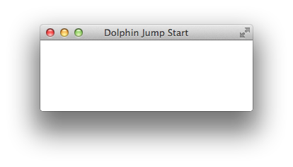

For an easy entry into OpenDolphin, we will follow the steps described in section "JavaFx example" of the
link:https://github.com/canoo/DolphinJumpStart[DolphinJumpStart] project.

We implement a very simple application that contains only one text field and two buttons to 'save' or 'reset' the value.
'Saving' will do nothing but printing the current field value on the server side.

Both buttons are only enabled if there is really something to save/reset, i.e. the field value is dirty.
The dirty state is also visualized via a CSS class (background color changes). Resetting triggers a 'shake' animation.
This chapter covers the usage of OpenDolphin for Java Desktop clients using JavaFX.

Steps 0 to 4 solely live in the "combined" module for a simple jumpstart
before we properly split client and server in step 5 and only keep a starter class in "combined".

Step 7 produces a WAR file that you can deploy in an application server (i.e. Tomcat) and the code that starts the client
moves to the "client" module.

*Setup and start of a basic JavaFX view*

Let's start with the setup.

Please make sure you have visited the link:https://github.com/canoo/DolphinJumpStart[DolphinJumpStart] project
and have looked at the readme.

You can either choose to clone the repo for following each step (recommended)
or use the provided zip files for a Maven or Gradle build of your own application.

The root directory contains a maven pom.xml that you may want to import into your IDE for creating a project.
All major IDEs support projects based on maven pom files.

In case you are not using an IDE, follow the readme for how to build and run the various steps.

We start our development in the "combined" module with the simplest possible JavaFX view
link:https://github.com/canoo/DolphinJumpStart/blob/master/combined/src/main/java/step_0/JumpStart.java[step0.JumpStart]
The class has a main method such that you can start it from inside the IDE.
Otherwise use the command line launcher as described in the readme.

When your setup is correct, it should appear on your screen like:

This code illustrates a simple call to the JavaFX API. This code displays a window with the title "Dolphin Jump Start"
displayed in the title of the window.

[source,java]
public class JumpStart extends Application {
    @Override
    public void start(Stage primaryStage) throws Exception {
        primaryStage.setScene(new Scene(new Pane(), 300, 100));
        primaryStage.setTitle("Dolphin Jump Start");
        primaryStage.show();
    }
    public static void main(String[] args) {
        launch(JumpStart.class);
    }
}

You are free to also use any other Java-based widget toolkit at this point:
Swing, AWT, SWT, Eclipse RCP, or any other UI toolkit that runs in a JVM (Java Virtual Machine).
OpenDolphin doesn't care which UI toolkit is used.

Of course, the application needs some sensible content, which we will add right away.
Note that we haven added any OpenDolphin specific code to our examples (yet).