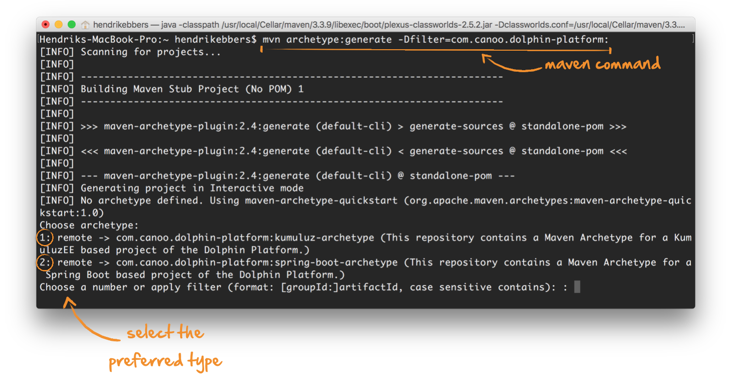

#Dolphin Platform Jumpstart
To get started with Dolphin Platform and create your first client-server-project several Maven archetypes are provided by Dolphin Platform. Based on this archetypes it's quite easy to create a full functional client-server-application as a perfect base for your own project or to learn the different APIs of Dolphin Platform by simply experimenting with the generated project.
###Create a project
 To create a new project only Maven must be installed on your system. Once Maven is installed you can create a complete project with only one shell command:
 ```shell
 mvn archetype:generate -Dfilter=com.canoo.dolphin-platform:
 ```
 The command will start a Maven process that creates the new project. To do so you can choose between different options in a shell wizard:
 
As a first step you need to choice on what archetype your project should depend. Dolphin Platform provides several archetypes to create for example projects that uses Spring Boot or JavaEE on the server. After you have defined the archetype you need to select a version of the archetype. This version is related to the Dolphin Platform version the archetype depends on. Here it's best pratice to simply select the last version. As a last step you need to specify ``` groupId ```, ``` artifactId ``` and the ``` version ``` of your new project. Once this is done the generation might takle some time on the first call since all needed dependencies and plugins are downloaded to your computer. You can simply import the generated project in any IDE of your choice that supports Maven projects. The generated project conrtains a readme.md file that describes how the client and server parts of the project can be startet.
